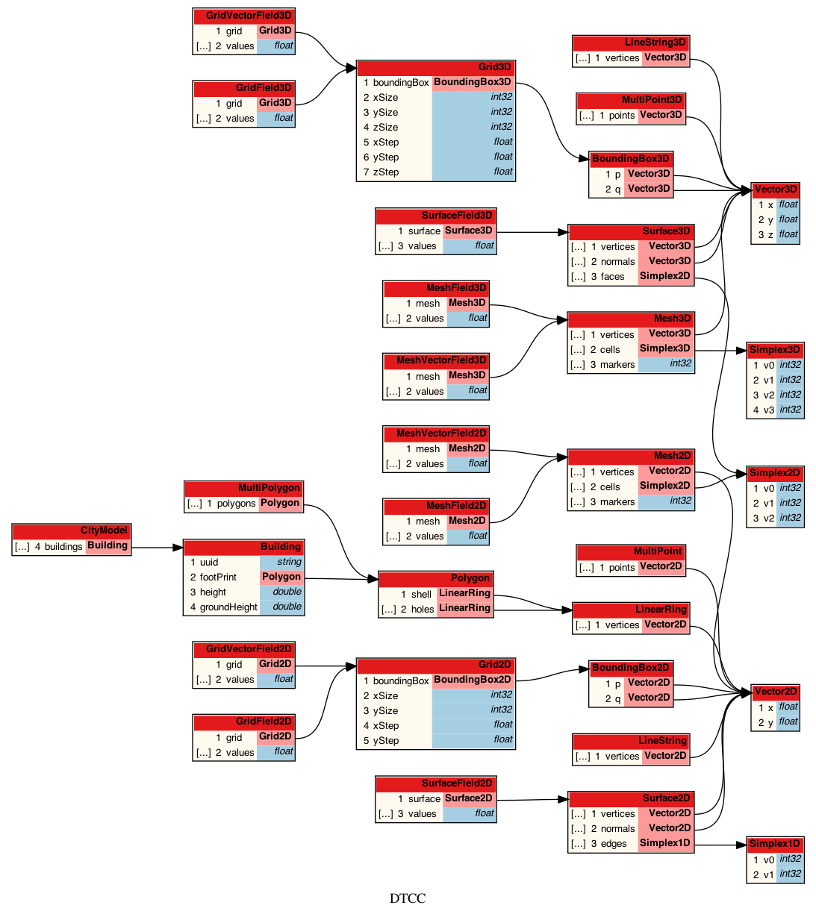

# DTCC Model

_This README was last revised on 22nd of March 2022_

The DTCC Platform is an open-source platform for the exploration of
digital twins for cities. The platform is developed and maintained by
the Digital Twin Cities Centre (DTCC) hosted by Chalmers University of
Technology. The aim is to develop an open modelling, simulation and
visualisation platform for interactive planning, design, and
exploration of cities.

This repository, DTCC Model, defines the common data model(s) for the
DTCC Platform, as well as utilities for working with the data
model(s).

## Getting started

The following instructions will get you up and running on your local machine
for development and testing purposes.

### Downloading the software

To download the software, clone the repository by the following command:

    git clone https://gitlab.com/dtcc-platform/dtcc-model.git

Alternatively, you may want to use the SSH protocol:

    git clone git@gitlab.com:dtcc-platform/dtcc-model.git

This will create a directory named `dtcc-model` containing the full
source code.

**Note:** If you are using Windows, you might first want to make sure
that Git does not convert Unix-style file endings on checkout. This
can be accomplished by:

    git config --global dtcc-model.autocrlf false

### Installation

_The following instructions are a preliminary sketch. More refined instructions to be added._

Installing Protobuf on Ubuntu:

    sudo apt-get install protobuf-compiler
    pip install protobuf

Building Protobuf classes:

    cd protobuf
    ./build

## Authors (in order of appearance)

* [Anders Logg](http://anders.logg.org)

## License

The DTCC Platform is licensed under the [MIT
license](https://opensource.org/licenses/MIT).

Copyright is held by the individual authors as listed at the top of
each source file.

## Acknowledgments

This work is part of the Digital Twin Cities Centre supported by
Sweden’s Innovation Agency Vinnova under Grant No. 2019-421 00041.
